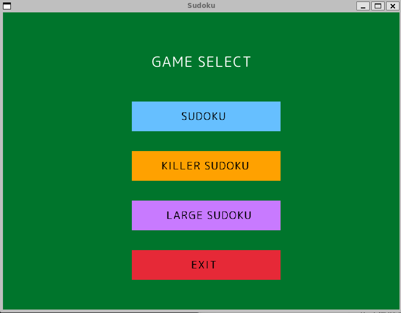
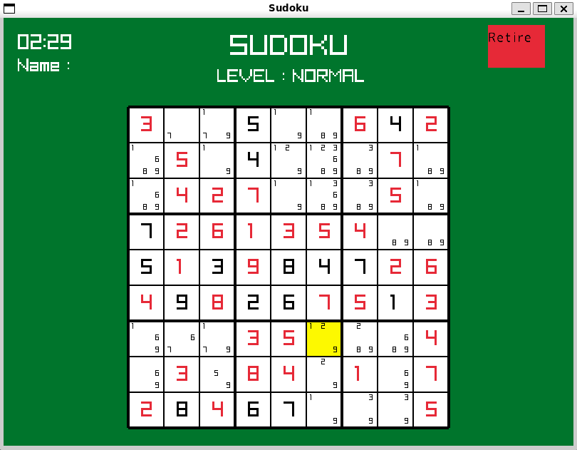
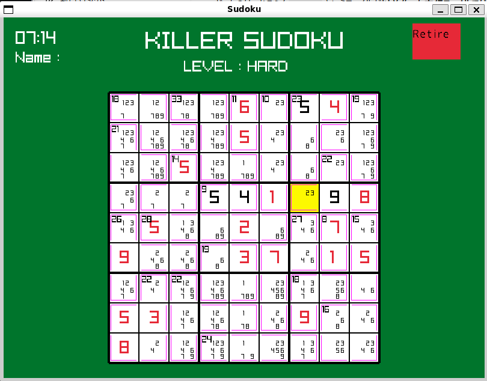
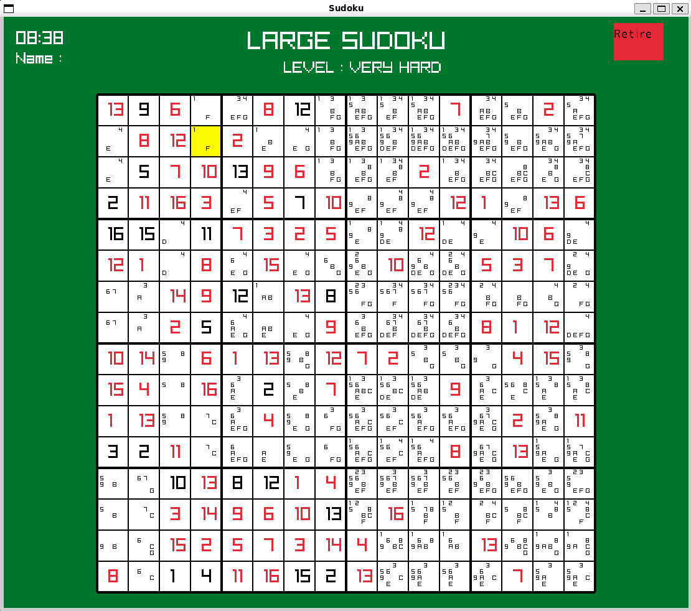
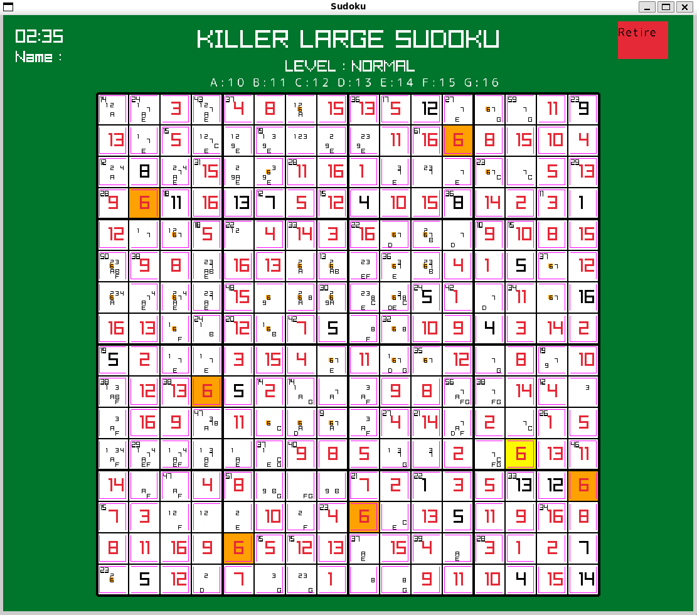

# Sudoku

C++とraylibを用いて制作した数独ゲームです。

通常数独・キラー数独・16×16大型数独・16×16大型キラー数独の4種類をプレイできます。 
問題はランダム生成され、メモ機能やタイマー、難易度選択なども実装しています。

## 開発環境

- C++
- raylib
- VSCode
- WSL Ubuntu

## モード

| モード | サイズ |
|---|---|
| Normal Sudoku | 9×9 |
| Killer Sudoku | 9×9 |
| Large Sudoku | 16×16 |
| Killer Sudoku (Large) | 16×16 |

## スクリーンショット

### Menu



### Normal Sudoku



### Killer Sudoku



### Large Sudoku



### Killer Large Sudoku



## 機能

- ゲーム選択(数独 / キラー数独 / 大型数独 / 大型キラー数独)
- ランダム問題生成
- 難易度選択(Normal / Hard / Very Hard)
- 名前入力
- タイマー
- メモ機能
- 同じ数字のハイライト表示
- リザルト画面

## 操作方法

| 操作 | 内容 |
|------|------|
| 左クリック | マス選択 |
| 右クリック | メモ入力 |
| 1～9 | 数字入力 |
| 0 | マスの数字削除 |
| A～G | 16×16数独の10～16入力 |

## 工夫した点

- マスの拡張を考慮した可変サイズ設計
- キラー数独のケージ自動生成
- メモ機能の実装
- 判定によるマスの色変え
- 難易度ごとの問題生成

## ライセンス

This project is licensed under the MIT License.

This project also uses:

- raylib (zlib License)
- M PLUS Rounded 1c (SIL Open Font License 1.1)

## 実行方法

### Linux (WSL)

```bash
g++ src/*.cpp -o Sudoku -I/usr/local/include -L/usr/local/lib -lraylib -lGL -lm -lpthread -ldl -lrt -lX11

./Sudoku